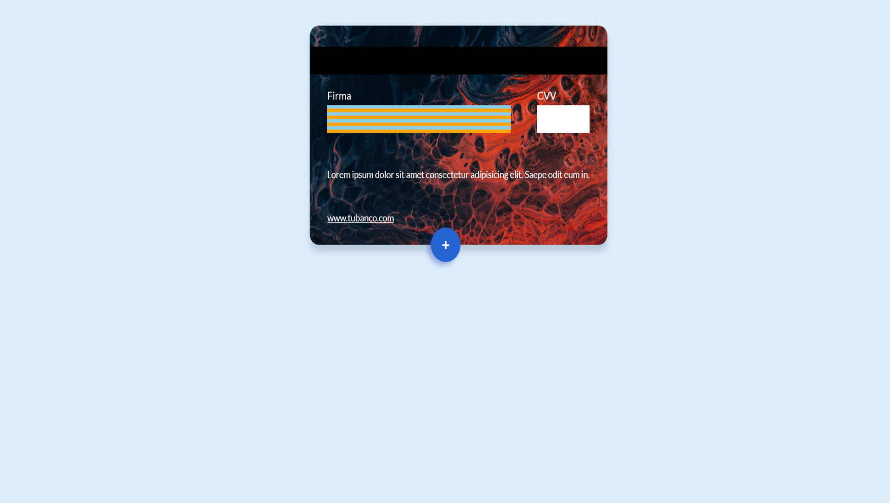

# Credit card simulation created with css (sass) and javascript, it has functions such as:

* Form Validation
* DOM manipulation
* Add and remove classes
* CSS Animations

**Screenshot 1**

**Screenshot 1.1**

**Screenshot 2**

**Screenshot 2.1**

**Screenshot 3**

**Screenshot 3.1**
